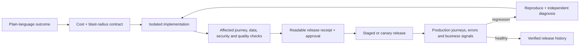

# Beyond the first prompt

## Where Gate 15 can innovate in AI app building

**Research date:** July 13, 2026  
**Scope:** Current product documentation, pricing, status pages, public reviews, Reddit communities, Hacker News discussions, and Gate 15's live codebase. Pre-existing repository material under `notes/` was explicitly excluded and was not opened or used; this finished report was placed there afterward at the user's request.

---

## Executive decision

The market is increasingly good at **Day 0**: turning a prompt into an impressive first version.

The public's unmet need is **Day 2 onward**: changing that app without breaking it, knowing when it actually works, getting it safely into production, understanding the system, controlling what the agent spends, recovering from failures, and leaving the platform without rebuilding.

The clearest opportunity for Gate 15 is therefore not another “generate an app faster” claim. It is a product promise closer to:

> **Every change comes with a budget, evidence that it works, and a safe way back.**

Or, in shorter market language:

> **Build fast. Prove it works. Keep it working.**

That position is defensible because the individual ingredients now exist across competitors, but among the eight platforms reviewed I found no documented, integrated workflow that delivers the whole lifecycle as one coherent contract:

1. The user states an outcome in plain language.
2. The platform states the likely cost, blast radius, and acceptance checks before acting.
3. The agent works in an isolated change set with enforceable boundaries.
4. The platform verifies the affected user journeys, data rules, security rules, and production build.
5. The user receives a readable release receipt, not a confident “done.”
6. Production telemetry and user reports can reproduce failures automatically.
7. A fix is re-verified, rolled out safely, and rolled back if the measured result worsens.

Gate 15 already has unusually useful pieces of this system: isolated Firecracker environments, multi-provider routing, interactive browser verification, persistent replayable flows, a blocking pre-deploy check, checkpoints, plan/review surfaces, and subagents. The highest-return strategy is to turn those pieces into a visible **trust system**, then close the Git, environment, monitoring, and portability gaps needed to make the promise real.

### Recommended priority

| Priority | Product bet | Public evidence | Differentiation | Gate 15 fit | Recommendation |
|---|---|---:|---:|---:|---|
| P0 | Real Git, exact rollback, environment safety, telemetry foundation | Competitive parity / prerequisite | Low alone | High | Run in parallel now |
| 1 | App Contracts + Verified Releases | Broad recurring | High as an integrated system | Very high | Build now |
| 2 | Cost Contract + multi-model recovery | Broad recurring | Very high | Very high | Build now |
| 3 | Operate Mode: production issue to verified patch | Broad recurring | High | High | Build next |
| 4 | Living App Map for non-engineers | Recurring | High | High | Build next |
| 5 | Verified full-stack ownership and exit drills | Broad recurring | High | Medium-high | Start with Git parity now; expand next |
| 6 | Backend Truth and transactional data safety | Broad recurring | Medium-high | High | Fold into releases and Operate Mode |
| 7 | Native mobile/store pipeline | Recurring | Medium | Low-medium today | Later strategic choice, not the first wedge |

The key insight is that the whitespace is a **system**, not a checkbox. Browser testing alone, Git export alone, a security scan alone, or a staging database alone is already competitive parity.

---

## Research method and confidence

This report triangulates three kinds of evidence:

- **Firsthand public sentiment:** platform-specific subreddits, no-code and vibe-coding communities, Hacker News, product forums, and public reviews.
- **Current product reality:** official documentation, pricing pages, release information, and status incidents, checked against complaints so older limitations are not presented as current facts.
- **Gate 15 feasibility:** the current repository outside `notes/`, especially the agent verification path, saved flows, checkpoints, deployment limits, Git import behavior, and monitoring gaps.

Complaint forums are self-selecting and review sites have different biases. Trustpilot tends to overrepresent incidents; Product Hunt, G2, and Capterra tend to overrepresent successful onboarding and enthusiastic early users. Reddit posts can be mistaken, promotional, or written by consultants selling rescue work. The report cites 34 representative public discussion URLs and 49 official or independent product/risk sources. Public-sentiment examples run primarily from January 2025 through July 2026; older complaints are used only when the same pattern recurs and current official documentation was checked for subsequent product changes. Accordingly:

- **Broad recurring** means the same underlying problem appears in ordinary-user reports across at least four platform or builder communities in the reviewed sample.
- **Recurring** means it appears across two or three independent platform or builder communities.
- **Latent/high severity** means explicit public requests are less frequent, but expert testing, incidents, or the consequence of failure makes the issue important.
- Individual dollar amounts and dramatic incident claims are treated as anecdotes unless independently verified.
- The report does not claim that competitors never work. Many users build successful products with them.
- The defensible conclusion is that successful users still apply engineering disciplines—specification, tests, version control, staging, observability, and human judgment—that the marketed nontechnical user was led to believe the builder would supply.

---

## What the public wants and is not reliably getting

### 1. Stop charging me while the agent repairs its own mistake

**Signal: broad recurring, across Lovable, Bolt, Replit, v0, and Base44.**

Users do not object simply to paying for AI. They object to an unbounded meter attached to an agent that can introduce an error, repeatedly claim to fix it, regress another feature, and consume more credits throughout the loop.

Representative evidence:

- A [Lovable thread with more than 200 upvotes](https://www.reddit.com/r/lovable/comments/1le45id/the_problem_with_lovable/) describes spending repeated batches of credits fixing issues the system said were fixed, while a separate user reported an [auth failure created during iteration](https://www.reddit.com/r/lovable/comments/1jcuton/getting_so_frustrated_with_lovable/).
- Bolt users report [10–15 million tokens spent in a repair loop](https://www.reddit.com/r/boltnewbuilders/comments/1icq1t3/10m15m_tokens_wasted_trying_to_get_boltnew_to_fix/) and explicitly ask for [a cost estimate and approval before a large task begins](https://www.reddit.com/r/boltnewbuilders/comments/1srpt31/do_any_bugs_ever_get_fixed_at_bolt/).
- Replit users repeatedly describe [paid checkpoints and regression loops](https://www.reddit.com/r/replit/comments/1j5sxwl); the most dramatic 2026 billing post alleged [nearly $2,000 of usage](https://www.reddit.com/r/replit/comments/1ty0iti/replit_charged_me_1982_in_24_days_on_a_prelaunch/). The amount is not independently verified, but the reliable signal is that the user could not understand the cost of a task or find the hard cap before the damage was done.
- v0 users asked for [free error retries or refunds for failed attempts](https://www.reddit.com/r/vercel/comments/1kml86p/vercel_really_dropped_the_ball_with_the_new_v0dev/).
- Base44 users report [most credits going to debugging](https://www.reddit.com/r/Base44/comments/1t4mv21/great_potential_but_erasing_user_data_and_60/) and production runtime failures when credits are exhausted. Base44's own [credit documentation](https://docs.base44.com/Account-and-billing/Credits) confirms that build-message and live integration credits are separate meters, that usage varies, and that depleted integration credits can surface as a generic error to end users.

Competitors are responding, but not solving the trust problem. Replit now documents [budget controls and usage alerts](https://docs.replit.com/billing/ai-billing), yet all Agent work—including planning—is billable and reporting can lag. Rork's [FAQ](https://rork.com/faq) says AI errors are not charged. v0 provides a narrower remedy: up to 20 free daily [“Fix with v0”](https://v0.app/docs/agentic-features) uses for deployment errors on code the user has not edited. Neither is the broader task-level outcome contract described here.

**Unmet product request:**

- Quote a cost band and hard ceiling before execution.
- Show which files, services, and test journeys are likely to be touched.
- Pause for approval before exceeding the ceiling.
- Detect a repeated failure signature and stop instead of retrying indefinitely.
- Automatically restore the last known-good state, preserve the reproduction, and try an independent diagnosis.
- Do not meter platform-caused retries or repairs to a regression introduced in the immediately preceding change.
- Present cost per accepted feature or verified outcome, not only credits or tokens.

This is the strongest emotional complaint in the market and a natural Gate 15 advantage because multi-provider routing allows a second model to diagnose a failure rather than letting one model repeat the same reasoning.

### 2. Do not say “fixed” unless you can prove the user journey works

**Signal: broad recurring.**

Across products, the public describes the same shape of failure: the agent changes code, sees no obvious syntax error, declares success, and leaves the actual interaction broken. Fixing one issue often breaks a distant feature because the agent does not understand or verify the full behavioral contract.

Examples include Lovable users describing [months of regressions and moving repair work to GitHub-based coding agents](https://www.reddit.com/r/lovable/comments/1unsjh5/buggy_project/), a Bolt user reporting [an unauthorized regression that erased roughly 15 hours of work](https://www.reddit.com/r/boltnewbuilders/comments/1ufir9b/oh_dear_we_just_seeem_to_regress/), and Replit users reporting that [old mistakes return while new credits are consumed](https://www.reddit.com/r/replit/comments/1mcakc8). A broader Hacker News discussion argues that these systems create [legacy code and comprehension debt unusually early](https://news.ycombinator.com/item?id=44739556).

The public is not merely asking for more unit tests. It wants the platform to remember what “working” means:

- A customer can sign up, verify email, log in, and see only their own records.
- A subscription can be purchased, renewed, cancelled, and recovered after a failed payment.
- Creating an invoice still updates its totals, dashboard, emails, and permissions.
- A navigation or design change does not silently break mobile, keyboard, or role-specific behavior.
- A data migration preserves row counts, relationships, access policies, and critical business invariants.

Lovable, Replit, Base44, FlutterFlow, and v0 all now offer meaningful browser or agent testing. Lovable can [click, fill, navigate, inspect console/network activity, and test screen sizes](https://docs.lovable.dev/features/browser-testing); Replit can [record interactions and run accessibility and performance checks](https://docs.replit.com/references/agent/app-testing); Base44 has a [reusable scenario-based E2E testing agent](https://docs.base44.com/documentation/managing-app-data/testing-agent). This means “we have browser testing” is not a differentiated claim.

**The remaining whitespace is persistent, enforced definition-of-done:** the user defines critical outcomes once; the platform links every change to affected outcomes; it runs the right checks automatically; and the agent cannot close the task or publish while a critical contract is failing.

### 3. Help me cross the prototype-to-production cliff

**Signal: broad recurring.**

The first 60–80% is now cheap and exciting. The final 20%—auth, permissions, migrations, email, payments, domains, backups, deployment, monitoring, compliance, and incident response—still requires the knowledge users thought the platform was replacing.

- One Replit user spent close to $1,000 on an application that [worked in development but failed when payments and subscriptions reached production](https://www.reddit.com/r/replit/comments/1kb07vc/a_bitter_and_costly_experience_replit_is_not_for/).
- A Base44 production discussion asks for a sandbox because [platform changes affected signup, Stripe, and integrations in live apps](https://www.reddit.com/r/Base44/comments/1q5plx3/base44_is_breaking_apps_in_production_existing/).
- A Vercel community thread describes the familiar [“works locally, breaks in production” gap](https://www.reddit.com/r/vercel/comments/1sm6dv4/anyone_else_frustrated_when_ai_agents_work_in_dev/); the practical recommendation from experienced users is staging plus smoke tests.
- No-code users call repeated manual clicking after every update a [“testing tax”](https://it.reddit.com/r/nocode/comments/1pj99qf/whats_the_most_annoying_part_of_testing_nocode/?sort=top) and say customer-discovered defects destroy trust.
- A recent Hacker News discussion describes a [“100-hour gap”](https://news.ycombinator.com/item?id=47386636): generation accelerates the MVP, but correctness, security, performance, and verification still dominate the route to a real product.

Current competitor capability is uneven but more advanced than the usual “prototype-only” summary suggests. Replit offers strong production database separation, restore, deployment logs, resource metrics, analytics, and uptime monitoring. Base44 offers session replay, rage/dead-click detection, errors, and AI summaries. Lovable's beta [Project Monitoring](https://docs.lovable.dev/features/project-monitoring) now runs scheduled code and visitor-error checks, alerts the owner, and can hand findings into chat for a user-approved fix. However, Lovable says it does not replace testing, can miss or falsely flag issues, does not fix them automatically, consumes variable credits per run, and its documented [Test and Live environments](https://docs.lovable.dev/features/environments) stopped being available to new Cloud projects on March 24, 2026. Bolt has hosting, database logs, and security audits but no documented durable user-journey regression layer.

**Unmet product request:** make the final 20% a guided, inspectable release process rather than a checklist the user must know to request.

A credible release gate would cover:

- isolated development, staging, and production data;
- migrations rehearsed against a masked production-shaped dataset;
- auth and tenant-isolation probes using at least two test identities;
- payment lifecycle, transactional email, webhook, domain, and certificate checks;
- build, runtime, performance, accessibility, security, SEO, and critical journey checks;
- atomic or canary release, measured verification, and a tested rollback;
- a receipt showing what passed, what failed, what was not tested, and what still requires a human decision.

### 4. “I own my app” should mean the whole system, not a ZIP of the frontend

**Signal: broad recurring.**

Source export and GitHub are rapidly becoming table stakes. The unresolved complaint is that the exported code often depends on a proprietary backend, managed auth, database, storage, workflow engine, or hosting assumption that is not included in the export.

A no-code user summarized the problem as [owning the data while renting the logic](https://www.reddit.com/r/nocode/comments/1rqqnad/every_nocode_tool_says_no_vendor_lockin_and_every/). Base44 users have described [reverse-engineering the backend after raising money on an MVP](https://www.reddit.com/r/SaaS/comments/1preufn/i_raised_money_off_a_base44_mvp_then_found_out_i/). This must be dated carefully: Base44 now has two-way Git and stronger migration tools. Its current official documentation still says export includes frontend, backend functions, and per-table CSVs rather than the managed auth/database infrastructure itself ([mobile and export documentation](https://docs.base44.com/Building-your-app/Mobile-experience)).

The market has moved:

- Lovable has [two-way GitHub sync and ordinary Vite/React code](https://docs.lovable.dev/integrations/github) and documents frontend/backend/data self-hosting, although exporting from Lovable Cloud is [possible but not straightforward](https://docs.lovable.dev/integrations/cloud).
- v0 now imports GitHub, creates a branch per chat, commits, and opens pull requests ([GitHub integration](https://v0.app/docs/github)).
- Bolt supports existing repositories and branch-aware synchronization ([Git integration](https://support.bolt.new/integrations/git)).
- Replit imports several providers and ordinary repositories, but its [import documentation](https://docs.replit.com/build/import-from-providers) explicitly notes that secrets, custom domains, database data, and provider-specific services do not come across in a ZIP.
- Bubble remains the clearest lock-in case: its [ownership documentation](https://manual.bubble.io/account-and-marketplace/application-and-data-ownership) says applications run on Bubble and the application code cannot be exported.

**Unmet product request:** a reproducible exit, not an export button.

A Gate 15 exit bundle should eventually include:

- frontend and backend source with no required Gate 15 runtime;
- schema, relationships, migrations, constraints, and a relational data dump;
- files/storage export and mapping;
- auth-user migration options and explicit provider limitations;
- jobs, queues, schedules, functions, webhooks, and API contracts;
- secret names and provenance without secret values;
- deploy configuration, Docker/container artifacts, health checks, and an operations runbook;
- the App Contract, architecture map, decision history, and verification evidence;
- an automated “exit drill” that deploys to neutral infrastructure and runs the critical journeys.

The trust-enhancing paradox is valuable: making it easy to leave may persuade serious customers that it is safe to stay.

### 5. Give non-engineers a visible, maintainable model of the app

**Signal: recurring.**

The public increasingly understands that generation is not the same as ownership. Nontechnical founders ask [who will maintain the app after the AI builds it](https://www.reddit.com/r/nocode/comments/1tsrghl/ai_can_build_the_app_fast_but_who_maintains_it/) and whether [another person can understand and take over the result](https://www.reddit.com/r/nocode/comments/1u4zzdl/ai_can_build_the_app_fast_but_can_someone_else/). One discussion contrasts opaque AI output with n8n because [visible workflows provide control](https://www.reddit.com/r/nocode/comments/1u94t23/are_ai_app_builders_actually_replacing/).

Traditional visual builders expose logic but can lock users into proprietary runtimes. Code-generating builders provide portable files but expose a codebase that their target customer cannot understand. The unsolved interface is between those two worlds.

**Unmet product request:** a code-derived Living App Map that shows, in plain language:

- screens, routes, and the user journeys connecting them;
- roles and who can see or change each resource;
- database entities, relationships, policies, and migration history;
- integrations, webhooks, background jobs, email, payments, and secrets;
- which feature depends on which components and services;
- current production health, third-party cost drivers, and unverified areas;
- why important architecture or product decisions were made;
- the predicted impact of a proposed change before the agent executes it.

The map must be derived continuously from code and runtime evidence, not maintained as a stale diagram. A non-engineer should be able to ask “what could break if we change organization roles?” and see the answer; an engineer receiving the project should get the same map as a handoff artifact.

### 6. Secure the behavior, not merely the source code

**Signal: latent/high severity; explicit demand is less frequent than regression or billing complaints.**

App-level security is particularly dangerous for the audience these products attract: users often do not know that client-side hiding is not authorization, that two tenants must be tested separately, or that a webhook must be verified on the server.

OWASP's 2025 guidance explicitly identifies inappropriate trust in AI-generated code as a risk and recommends review, tooling, and guardrails ([OWASP Top 10:2025 next steps](https://owasp.org/Top10/2025/X01_2025-Next_Steps/)). In May 2026, Axios reported that a security company found hundreds of thousands of exposed public assets associated with app-builder deployments and that Axios independently verified several examples containing sensitive data ([Axios investigation](https://www.axios.com/2026/05/07/loveable-replit-vibe-coding-privacy)). A Lovable user performing independent tests found recurring [Supabase/RLS and server-validation problems](https://www.reddit.com/r/lovable/comments/1low49w/followup_on_security_in_vibecoded_apps_its_worse/).

Generic security scanning is no longer white space. Lovable, Replit, Bolt, Base44, v0, and others now document combinations of dependency scanning, leaked-secret detection, code scanning, RLS checks, headers, or threat modeling. Their own responsibility models correctly stop short of guaranteeing that a generated app is secure.

**The product opportunity is security evidence integrated into the behavioral contract:**

- a role/resource access matrix generated in plain language;
- tenant-isolation tests that call the real API with two identities;
- permission diffs required for review whenever a schema or role changes;
- deny-by-default data rules and scoped agent credentials;
- migration safety, backup, destructive-action approval, and restore tests;
- webhook signature, secret placement, rate-limit, and file-access probes;
- SAST, dependency checks, DAST, SBOM, and secret provenance as supporting evidence;
- critical findings that block publication and are re-probed after repair.

“Security scan passed” is too weak. “Alice cannot retrieve Bob's invoice; here is the test and result from this release” is useful.

### 7. When a live business is broken, give me ownership and a real rescue path

**Signal: recurring.**

Support complaints become most intense when a custom domain, deployment, billing system, or production database is down and the customer receives only a bot or a community referral.

Examples include a Bolt customer whose [domain verification remained stuck after bot escalation](https://www.reddit.com/r/boltnewbuilders/comments/1tioy7w/domain_verification_issues_hoping_this_will_get/), a Lovable user reporting a [custom domain detaching despite correct DNS](https://www.reddit.com/r/lovable/comments/1sz20ci/has_anyone_seen_a_lovable_custom_domain_randomly/), and Replit users describing [deployment failures consuming credits while support remained slow](https://www.reddit.com/r/replit/comments/1to09km/replit_support_and_publishing_is_awful/). Lovable's current [support policy](https://docs.lovable.dev/introduction/support-policy) offers official support to paying workspaces, with an initial AI response and human routing on request.

**Unmet product request:** incident handling that already knows what happened.

- Attribute the failure to application code, Gate 15 infrastructure, deployment provider, DNS, database, or another integration.
- Create a reproduction containing the release diff, environment, logs, failed journey, network evidence, and last known-good checkpoint.
- Escalate repeated unresolved failures to a named human with severity, status history, and restoration authority.
- Provide a production assurance tier with an incident SLA.
- Never charge build credits for diagnosing a Gate 15 platform incident or a failed Gate 15 deployment.

Support should be the human end of the same verification and recovery system, not a disconnected ticket form.

### 8. Secondary requests: real, but not the first strategic wedge

#### Native mobile and app-store submission

Demand is persistent, especially around push notifications, permissions, deep links, StoreKit/Play Billing, certificates, screenshots, and review rejection. Base44 users document repeated [iOS submission difficulty](https://www.reddit.com/r/Base44/comments/1s72dx7/ios_mobile_app/) and [native feature gaps](https://www.reddit.com/r/Base44/comments/1ua8ah3/app_store/).

This is not empty territory. Rork now specializes in React Native/Expo and SwiftUI with store assistance ([Rork FAQ](https://rork.com/faq)); FlutterFlow exports Flutter across mobile/web/desktop; Replit and Bolt have Expo paths; Bubble now supports native mobile while retaining its runtime lock-in. Gate 15 should pursue mobile only if it is willing to provide the whole native lifecycle—real devices, safe areas, offline behavior, permissions, push, purchase compliance, SDK upgrades, signing, store review, crash monitoring, and rollback. A generic web wrapper will not differentiate.

#### SEO, accessibility, responsive quality, and visual drift

Users report React SPA indexing problems in [Lovable projects](https://www.reddit.com/r/lovable/comments/1pv2jka/stepbystep_how_i_fixed_seo_issues_on_my_lovable/), responsive constraint failures that appear only at run time in [FlutterFlow](https://www.reddit.com/r/FlutterFlow/comments/1uk7kzp/problemas_con_layouts_responsivos_en_flutterflow/), and accessibility failures that automated scores missed in an [expert audit of a Lovable-built site](https://axesslab.com/lovable/).

These are important, but better treated as contract types inside Verified Releases than as separate top-level products:

- crawler-render and metadata verification for public routes;
- deployed Core Web Vitals, not preview-only performance;
- screenshot and layout diffs across device classes;
- keyboard, focus containment, label, screen-reader announcement, zoom, and reflow checks;
- design-token and component locks to prevent visual drift.

#### Growth and feedback

Public discussions correctly point out that generating software does not find customers. A complete marketing suite would diffuse Gate 15's focus. A more natural extension of Operate Mode is to capture user feedback, failed journeys, conversion drops, and feature requests, then translate them into a ranked, testable product backlog.

---

## What competitors already provide in 2026

The following is a current-state correction to the common, increasingly stale view that competitors only generate prototypes.

| Platform | Meaningful current strengths | Residual gap relevant to Gate 15 |
|---|---|---|
| Lovable | Two-way GitHub, ordinary code, browser testing, frontend/edge tests, security scanning, analytics/monitoring, integrated cloud and payments | Cannot import an existing GitHub repository; testing is often requested rather than a persistent release contract; Test/Live unavailable to new Cloud projects; Cloud exit remains operationally difficult; variable shared credits |
| Replit | Broad imports, real Git/branches, checkpoints with optional DB restore, dev/prod database separation, browser testing, security center, deployment logs/resources/uptime | Agent testing and planning consume usage; cost/autonomy trust remains a complaint; production investigation is not yet a cross-provider contract-to-canary loop |
| Bolt | Existing repo import, Git sync, hosting, Postgres/auth/storage/functions, logs and security audit, Expo path | Repair-token complaints; version history does not restore DB; JS backend constraint; no documented durable regression-contract surface |
| v0 | Strong UI, Git import, branch per chat, commits/PRs, browser/terminal/unit verification, Vercel deployment | Vercel-centric operations and external backend integrations; ad-hoc verification rather than persistent lifecycle contract; backend handoff still confuses nontechnical users |
| Base44 | Integrated full stack, imports/migrations, two-way Git, test DB, reusable E2E scenarios, session replay, security scan | Managed auth/database infrastructure is not fully portable; Git is constrained to `main` and has reconnection and pre-integration-history caveats; test DB does not sync from production; live integration credits can affect users; native output remains wrapped web |
| Bubble | Mature visual workflows, dev/live data, version control, real native mobile | Proprietary runtime and no source export; AI agent still cannot handle several important backend/workflow/plugin categories |
| FlutterFlow | True Flutter output, source export, Git/CI/store paths, native multi-platform, AI Test Pilot | Server project remains source of truth; environment consistency is manual; small automated-test plan caps; backend/security responsibilities cross external consoles |
| Rork | Focused native generation in Expo/React Native and SwiftUI, two-way Git, store assistance, no charge for AI errors | Agent loops and false fix claims are acknowledged; support will not repair individual code; no documented persistent regression, production monitoring, or security evidence system |

Important conclusion: Gate 15 should not market isolated features such as “AI browser testing,” “GitHub export,” “security scan,” “session replay,” or “staging” as the innovation. The innovation is making these parts enforce one understandable promise across the app's lifecycle.

---

## Gate 15's current advantage—and the gaps to be honest about

### Strong foundation already in the codebase

Gate 15 is better positioned for this strategy than a blank-sheet entrant:

- The current [README](../README.md) documents multi-provider routing, per-turn planning and permissions, subagents, live previews, encrypted project secrets, Firecracker isolation, design packs, Vercel deployment, checkpoints, GitHub creation, and ZIP export.
- `interact_preview` in [`services/orchestrator/src/agent/tools.ts`](../services/orchestrator/src/agent/tools.ts) drives real click/fill/assert flows and returns screenshots, console errors, failed requests, accessibility/layout/contrast checks, and a blocking pass/fail verdict.
- `save_flow`, `run_flow`, and `list_flows` in the same file persist reusable smoke journeys; [`services/orchestrator/src/db/flows.ts`](../services/orchestrator/src/db/flows.ts) stores their last result; [`apps/web/components/AgentPreviewPanel.tsx`](../apps/web/components/AgentPreviewPanel.tsx) exposes frame-by-frame execution and one-click replay.
- The system prompt in [`services/orchestrator/src/agent/loop.ts`](../services/orchestrator/src/agent/loop.ts) already treats failed interactive checks and the production `predeploy_check` as blocking and tells the agent to replay saved flows after relevant changes.
- [`docs/checkpoints.md`](../docs/checkpoints.md) describes an automatic shadow-git checkpoint after every successful mutation, including a “pre-restore” checkpoint before a restore.
- Comments, tasks, design systems, project knowledge, Activity Monitor, and plan/review surfaces provide UI and data-model ingredients for a nontechnical approval workflow.

This is an excellent seed for App Contracts. The product does not need to invent browser execution or flow storage; it needs to elevate them from agent tools into the user's durable definition of the product.

### Current gaps that block the promise

These are important because they should shape sequencing:

1. **Saved flows are smoke checks, not yet a complete contract system.** They are generally created after a feature works, at the agent's discretion. There is no user-owned contract graph, impact selection, release receipt, production schedule, or business/data invariant layer.
2. **Git is behind current parity.** [`docs/github-import.md`](../docs/github-import.md) says the UI strips imported history in practice, the branch switcher does not fetch or check out remote work, and pull/fetch/push/PR creation are not implemented.
3. **Deployment is narrow.** [`docs/supported-stacks-and-limits.md`](../docs/supported-stacks-and-limits.md) says Vercel is the only built-in one-click target; there is no always-on/container target and Gate 15 does not generate a Dockerfile or Compose setup.
4. **Customer-app production feedback is missing from the current product surface.** A repository-wide product/code audit found no generated-app telemetry ingestion, production error/trace UI, scheduled production journey runner, or issue-to-reproduction path. This is distinct from Gate 15's own control-plane operations: [`docs/soc2-controls-inventory.md`](../docs/soc2-controls-inventory.md) separately records missing internal metrics-based alerting, anomaly detection, and an incident-response runbook. Both gaps matter, but only the first prevents the generated-app verification loop from continuing after launch.
5. **Rollback is not fully exact.** [`docs/checkpoints.md`](../docs/checkpoints.md) states current restore overwrites files from the target checkpoint but does not delete files added later; the declared retention policy is also not enforced.
6. **The visible task queue is not yet dependable automation.** [`apps/web/components/TasksView.tsx`](../apps/web/components/TasksView.tsx) tells users queued tasks run when the asynchronous runner is enabled.

Real Git, exact rollback, environment separation, production observability, and a broader deploy story are not all differentiators. They are foundations Gate 15 must close before claiming lifecycle ownership.

---

## The recommended product system

### The core loop

### Bet 1: App Contracts and Verified Releases

An **App Contract** is the durable, user-visible definition of what must remain true. It combines several layers:

- **Journey contracts:** “A new teacher can create a class and invite a student.”
- **Permission contracts:** “A student cannot view another student's work.”
- **Data contracts:** “Publishing a course never deletes existing enrollments.”
- **Integration contracts:** “A paid Stripe subscription grants access exactly once.”
- **Quality contracts:** supported breakpoints, accessibility, SEO, performance budget, browser/runtime support.
- **Operational contracts:** health checks, backup age, error budget, email delivery, scheduled job completion.

Before a task, Gate 15 should show:

- the interpreted outcome and acceptance criteria;
- affected contracts, screens, data, integrations, and likely files;
- estimated effort/cost band and maximum approved spend;
- proposed migration or destructive actions;
- explicitly excluded areas.

After a task, the **release receipt** should show:

- behavioral summary and plain-language diff;
- files/schema/policies/infrastructure changed;
- journeys run with screenshots or replay;
- build, test, security, accessibility, performance, and migration results;
- what was not tested and why;
- actual spend versus estimate;
- checkpoint/commit and one-click rollback;
- verifier identity, including whether a different model independently checked the work.

This turns Gate 15's existing saved flows into a product users can understand and trust. It also creates a compounding moat: each serious project accumulates a better contract and safer change history over time.

**North-star metric:** percentage of production changes accepted with a complete receipt and no escaped critical-journey regression within seven days.

### Bet 2: Cost Contract and multi-model recovery

Gate 15 should treat cost predictability and technical recovery as one system.

**Preflight:** estimate a range using project size, task class, selected model, affected contracts, and historical tasks. Let the user approve a hard cap.

**Progress accounting:** separate useful implementation, verification, and recovery. Show the estimated cost to finish, not merely cost already spent.

**Stuck-loop detection:** fingerprint failing tests, console errors, stack traces, and unchanged diffs. If the same failure recurs or objective progress stalls:

1. stop the active model;
2. preserve the minimal reproduction and failed contract;
3. restore the last clean checkpoint if the change made the project worse;
4. ask a different provider/model for an independent root-cause analysis;
5. compare a constrained patch against the original approach;
6. apply only after the relevant contract passes.

**Commercial rule:** platform-caused retries and repair of an immediately introduced regression should not consume the user's accepted task budget. This can be bounded rather than unlimited: one verified recovery path, clear eligibility, and evidence-backed attribution.

This is more defensible than a blanket refund button and much more legible than raw token billing. It aligns the business with accepted outcomes while using Gate 15's provider diversity as a real reliability feature instead of another model picker.

**North-star metrics:** median cost per accepted task; estimate error; percentage of failed loops stopped before cap; recovery success; recovery cost absorbed by Gate 15; billing disputes per 1,000 tasks.

### Bet 3: Operate Mode—production issue to verified patch

Operate Mode extends the same contracts after deployment.

The input should combine:

- server/client errors and traces;
- deployment, database, job, webhook, email, and third-party health;
- resource/cost anomalies;
- synthetic runs of critical journeys;
- consented session context and a user “report a problem” widget that captures steps, screenshot, console/network evidence, account/role, and release version;
- product signals such as conversion or completion drops.

The safe loop is:

1. attribute and cluster the incident;
2. reproduce it in an isolated environment with sanitized production-shaped data;
3. create a regression contract;
4. propose a narrow patch and risk assessment;
5. replay affected contracts;
6. request approval, canary the change, and measure the result;
7. promote or automatically roll back;
8. retain the incident and receipt as project knowledge.

Lovable's scheduled code/visitor-error monitoring, Replit's downtime investigation, Base44's session replay, and emerging products such as [Codemend](https://codemend.ai/) and [Repro](https://repro.dev/) validate demand for pieces of this flow. The remaining opportunity is a deterministic chain from real-user evidence to reproduction, a persistent regression contract, constrained patch, staged/canary rollout, measured verification, and automatic rollback—using Gate 15's existing browser verifier, checkpoints, and cross-model recovery across both Gate 15-managed and portable deployments.

**North-star metrics:** mean time to reproduce, mean time to verified recovery, percentage of user reports converted into reproductions, canary rollback rate, repeat-incident rate, and production-project retention.

### Bet 4: Living App Map and Backend Truth

The Living App Map should be the shared interface for a founder, designer, engineer, reviewer, and support operator. It is not a diagramming tool. It is a code- and runtime-derived graph of:

- pages, components, journeys, roles, data, APIs, jobs, integrations, secrets, environments, deployments, and costs;
- edges showing which user outcomes depend on which technical pieces;
- verified, failing, changed, and unknown states;
- architecture decisions and do-not-touch boundaries;
- predicted blast radius before a task begins.

The Backend Truth view should make permissions and production risk especially concrete. For each resource, show who can read/write it, where enforcement lives, which tests prove it, and when it last passed. For every migration, show the rehearsal, row/relationship invariants, backup, and rollback plan.

This solves a deeper problem than project memory. It gives non-engineers control without hiding the real system and gives engineers a useful handoff instead of generated prose divorced from code.

**North-star metrics:** time for a new collaborator to explain the system correctly; impact-prediction precision; percentage of risky changes caught preflight; handoff success without original creator intervention.

### Bet 5: Verified ownership

This bet begins with competitive parity—real bidirectional Git, branches, and pull requests—but should end with something competitors do not prove: an executable exit.

Progressive levels could be:

1. **Code-owned:** GitHub is a true source of truth; users can pull, push, branch, review, and leave.
2. **Deploy-owned:** a reproducible container or supported neutral deployment target runs without Gate 15.
3. **Data-owned:** schema, migrations, relational data, files, and backup/restore are portable.
4. **Service-owned:** auth, jobs, functions, webhooks, secrets manifest, domains, and observability have documented migration paths.
5. **Verified exit:** Gate 15 periodically deploys the exit bundle outside its control plane and runs critical contracts against it.

Not every provider allows lossless auth-user or managed-service migration. The product should say that explicitly and provide the best available path rather than claim a fictional one-click exit.

**North-star metrics:** successful external deploy rate, complete exit-drill rate, time to engineer handoff, and migration issues per project.

---

## Roadmap

### First 30 days: turn existing verification into a user-owned object

- Rename/productize saved flows as **Critical Journeys** while retaining the underlying flow engine.
- Let users create, edit, pin, group, and mark journeys release-blocking from the UI.
- Capture acceptance criteria during Plan mode before code changes.
- Generate a first release receipt from current diffs, checkpoints, `interact_preview`, `run_flow`, tests, and `predeploy_check`.
- Add a hard per-task budget, stop control, and live usage-to-cap display. Start collecting task features and accepted outcomes for estimate calibration; do not show false precision yet.
- Implement failure fingerprints and stop repeated identical repair attempts.
- Make checkpoint restore exact and test it, including added-file deletion and a reliable undo of the restore.
- Start the P0 real-Git workstream immediately: preserve imported history in the UI, fetch/pull, actual branch checkout, push, and PR workflow.

### Days 31–90: make the promise enforceable

- Build contract-to-code/dependency impact selection so relevant journeys run automatically.
- Add permission/data invariants and two-identity tenant-isolation tests.
- Use a second provider as an independent verifier or recovery model for high-risk/failed work.
- Pilot “no charge for immediate agent-caused regression repair” with auditable eligibility.
- Complete and harden the real remote Git workflow, including conflict handling and PR review.
- After calibration, introduce wide confidence-banded task estimates; the hard cap remains the enforcement mechanism when confidence is low.
- Add builder/reviewer/publisher roles and a plain-language approval queue.
- Begin environment separation design with schema migration rehearsal and masked production-shaped test data.

### Months 3–6: carry the contract into production

- Add deployment/runtime telemetry, error attribution, health checks, and scheduled critical journeys.
- Ship a consent-aware user issue capture/reproduction widget.
- Add isolated staging, backup/restore drills, migration dry runs, canary release, and measured rollback.
- Launch Operate Mode for Vercel deployments first, then define an open telemetry contract for external deployments.
- Establish a production incident workflow with human escalation and credit authority.
- Add container/always-on deployment for supported stacks or generate a production-grade exit target.

### Months 6–12: make the system understandable and portable

- Ship the Living App Map and Backend Truth views.
- Add verified exit bundles and scheduled exit drills.
- Expand contracts to payments, email, jobs, accessibility, SEO, performance, and real-device coverage.
- Add dependency/security maintenance and business-cost forecasting.
- Decide whether native mobile is a strategic vertical. If yes, build a complete store/operations path rather than a wrapper.

---

## What Gate 15 should not chase

1. **Another fastest-first-prompt benchmark.** The first draft is crowded and rapidly commoditizing.
2. **More model logos as the headline.** Multi-provider capability should power reliability and recovery invisibly.
3. **A generic browser tester or security scanner.** Competitors already have them. Sell the enforced contract and evidence.
4. **ZIP export as “ownership.”** Source without data, services, and a proven deployment is not a complete exit.
5. **A generic native wrapper.** Rork, FlutterFlow, Replit, Bolt, and Bubble already occupy portions of mobile. Enter only with a full lifecycle.
6. **A sprawling marketing suite.** Product feedback and conversion health fit Operate Mode; broad acquisition tooling does not yet reinforce the core advantage.
7. **Feature volume at the expense of stability.** FlutterFlow and other mature communities explicitly complain when headline AI features arrive while core editor/runtime bugs persist. Reliability must be experienced, not merely positioned.

---

## Suggested positioning

The strategic category is not “another AI app builder.” It is an **evidence-backed app lifecycle for people who do not want to become DevOps engineers**.

Potential message hierarchy:

1. **Build fast. Prove it works. Keep it working.**
2. **Every release comes with evidence, a budget, and a way back.**
3. **Your critical journeys become permanent tests, not forgotten prompts.**
4. **When something fails, Gate 15 reproduces it, verifies the repair, and shows what changed.**
5. **Your code and your exit remain yours.**

The most ownable one-sentence product promise is:

> **Gate 15 builds apps that can prove they still work.**

This promise is narrower, more credible, and more valuable than claiming to generate any app. It turns the market's largest frustration—the loss of trust after the first impressive demo—into Gate 15's reason to exist.

---

## Selected evidence index

### Current official product capability

- Lovable: [GitHub](https://docs.lovable.dev/integrations/github), [browser testing](https://docs.lovable.dev/features/browser-testing), [testing](https://docs.lovable.dev/features/testing), [project monitoring](https://docs.lovable.dev/features/project-monitoring), [environments](https://docs.lovable.dev/features/environments), [security](https://docs.lovable.dev/features/security), [Cloud portability](https://docs.lovable.dev/integrations/cloud), [ownership/self-hosting](https://docs.lovable.dev/tips-tricks/deployment-hosting-ownership), [support](https://docs.lovable.dev/introduction/support-policy)
- Replit: [imports](https://docs.replit.com/build/import-from-providers), [App Testing](https://docs.replit.com/references/agent/app-testing), [checkpoints and rollback](https://docs.replit.com/references/version-control/checkpoints-and-rollbacks), [production database](https://docs.replit.com/references/data-and-storage/production-databases), [deployment monitoring](https://docs.replit.com/references/publishing/monitoring-a-deployment), [AI billing](https://docs.replit.com/billing/ai-billing), [security responsibility](https://docs.replit.com/references/security/shared-responsibility-model)
- Bolt: [Git](https://support.bolt.new/integrations/git), [Bolt Cloud](https://support.bolt.new/cloud/bolt-cloud), [database](https://support.bolt.new/cloud/database), [database security](https://support.bolt.new/cloud/database/security), [Expo/mobile](https://support.bolt.new/integrations/expo), [tokens](https://support.bolt.new/account-and-subscription/tokens)
- v0: [GitHub](https://v0.app/docs/github), [full-stack apps](https://v0.app/docs/full-stack-apps), [agentic verification](https://v0.app/docs/agentic-features), [deployments](https://v0.app/docs/deployments), [security](https://v0.app/docs/security)
- Base44: [migration](https://docs.base44.com/Getting-Started/migrating-an-existing-app), [two-way Git](https://docs.base44.com/developers/app-code/local-development/github), [testing agent](https://docs.base44.com/documentation/managing-app-data/testing-agent), [test data](https://docs.base44.com/documentation/managing-app-data/testing-your-data), [session recordings](https://docs.base44.com/documentation/performance-and-seo/session-recordings), [security scan](https://docs.base44.com/Setting-up-your-app/running-a-security-scan), [mobile/export](https://docs.base44.com/Building-your-app/Mobile-experience), [credits](https://docs.base44.com/Account-and-billing/Credits)
- Bubble: [application and data ownership](https://manual.bubble.io/account-and-marketplace/application-and-data-ownership), [version control](https://manual.bubble.io/help-guides/maintaining-an-application/version-control), [AI Agent limits](https://manual.bubble.io/help-guides/ai/bubble-ai-agent)
- FlutterFlow: [source export](https://docs.flutterflow.io/flutterflow-cli/exporting), [AI Test Pilot](https://docs.flutterflow.io/testing/test-pilot), [development environments](https://docs.flutterflow.io/testing/dev-environments)
- Rork: [FAQ and native capability](https://rork.com/faq), [agent-loop guidance](https://docs.rork.com/introduction/introduction/agent-loops), [code export](https://docs.rork.com/faq/code-export)

### Representative public sentiment

- Paying for failure: [Lovable](https://www.reddit.com/r/lovable/comments/1le45id/the_problem_with_lovable/), [Bolt](https://www.reddit.com/r/boltnewbuilders/comments/1icq1t3/10m15m_tokens_wasted_trying_to_get_boltnew_to_fix/), [Replit](https://www.reddit.com/r/replit/comments/1j5sxwl), [v0](https://www.reddit.com/r/vercel/comments/1kml86p/vercel_really_dropped_the_ball_with_the_new_v0dev/), [Base44](https://www.reddit.com/r/Base44/comments/1t4mv21/great_potential_but_erasing_user_data_and_60/)
- Regressions and context decay: [Lovable](https://www.reddit.com/r/lovable/comments/1unsjh5/buggy_project/), [Bolt](https://www.reddit.com/r/boltnewbuilders/comments/1ufir9b/oh_dear_we_just_seeem_to_regress/), [Replit](https://www.reddit.com/r/replit/comments/1nnvp06/disappointed_to_be_paying_for_agent_screwups/), [Hacker News](https://news.ycombinator.com/item?id=42701745)
- Production cliff: [Replit deployment/payments](https://www.reddit.com/r/replit/comments/1kb07vc/a_bitter_and_costly_experience_replit_is_not_for/), [Base44 production changes](https://www.reddit.com/r/Base44/comments/1q5plx3/base44_is_breaking_apps_in_production_existing/), [manual testing tax](https://it.reddit.com/r/nocode/comments/1pj99qf/whats_the_most_annoying_part_of_testing_nocode/?sort=top)
- Lock-in and handoff: [renting logic](https://www.reddit.com/r/nocode/comments/1rqqnad/every_nocode_tool_says_no_vendor_lockin_and_every/), [Base44 founder migration](https://www.reddit.com/r/SaaS/comments/1preufn/i_raised_money_off_a_base44_mvp_then_found_out_i/), [maintainability](https://www.reddit.com/r/nocode/comments/1tsrghl/ai_can_build_the_app_fast_but_who_maintains_it/), [comprehension debt](https://news.ycombinator.com/item?id=45423917)
- Security and operational trust: [OWASP](https://owasp.org/Top10/2025/X01_2025-Next_Steps/), [Axios](https://www.axios.com/2026/05/07/loveable-replit-vibe-coding-privacy), [Lovable security testing](https://www.reddit.com/r/lovable/comments/1low49w/followup_on_security_in_vibecoded_apps_its_worse/), [Replit production-data incident discussion](https://news.ycombinator.com/item?id=44632270)
